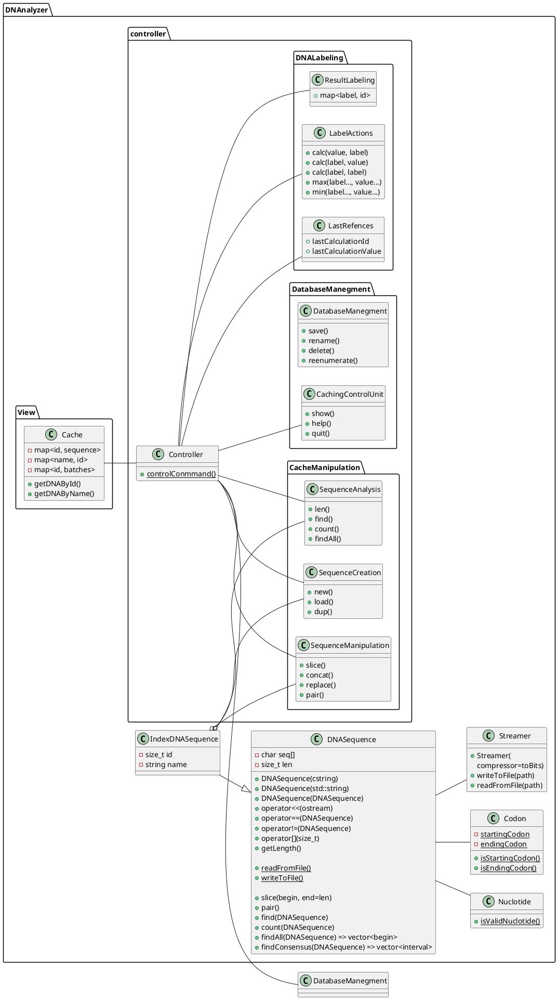
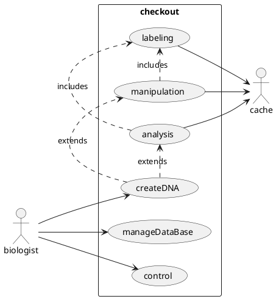
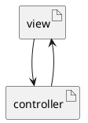

# **Class Diagram**

```plantuml
@startuml
left to right direction
package DNAnalyzer{

package controller{
package CacheManipulation{
    class SequenceCreation{
        + new()
        + load()
        + dup()
    }
    class SequenceManipulation{
        + slice()
        + concat()
        + replace()
        + pair()
    }
    class SequenceAnalysis{
        + len()
        + find()
        + count()
        + findAll()
    }
}


package DatabaseManegment{
    class DatabaseManegment{
        + save()
        + rename()
        + delete()
        + reenumerate()
    }
    class CachingControlUnit{
        + show()
        + help()
        + quit()
    }
}

package DNALabeling{
    class ResultLabeling{
        + map<label, id>
    }
    class LabelActions{
        + calc(value, label)
        + calc(label, value)
        + calc(label, label)
        + max(label..., value...)
        + min(label..., value...)
    }
    class LastRefences{
        + lastCalculationId
        + lastCalculationValue
    }
}

class Controller{
    {static} + controlConmmand()
}
}

class  IndexDNASequence{
    - size_t id
    - string name
}

class DNASequence{
    - char seq[]
    - size_t len

    + DNASequence(cstring)
    + DNASequence(std::string)
    + DNASequence(DNASequence)
    + operator<<(ostream)
    + operator==(DNASequence)
    + operator!=(DNASequence)
    + operator[](size_t)
    + getLength()

    {static} + readFromFile()
    {static} + writeToFile()

    + slice(begin, end=len)
    + pair()
    + find(DNASequence)
    + count(DNASequence)
    + findAll(DNASequence) => vector<begin>
    + findConsensus(DNASequence) => vector<interval>

}

class  Nuclotide{
    {static} + isValidNuclotide()
}

class Codon{
    {static} - startingCodon
    {static} - endingCodon
    {static} + isStartingCodon()
    {static} + isEndingCodon()
}

class Streamer{
    + Streamer(
        compressor=toBits)
    + writeToFile(path)
    + readFromFile(path)
}

package View{
class Cache{
    - map<id, sequence>
    - map<name, id>
    - map<id, batches>

    + getDNAById()
    + getDNAByName()
}
}

}
DNASequence -- Nuclotide
DNASequence -- Codon
DNASequence -- Streamer
IndexDNASequence --|> DNASequence

IndexDNASequence o-- SequenceCreation
IndexDNASequence o-- SequenceManipulation
IndexDNASequence o-- SequenceAnalysis

Cache -- Controller

Controller -- SequenceCreation
Controller -- SequenceManipulation
Controller -- SequenceAnalysis

Controller -- DatabaseManegment
Controller -- CachingControlUnit

Controller -- ResultLabeling
Controller -- LabelActions
Controller -- LastRefences
@enduml
```
# **Use-Case Diagram**

```plantuml
@startuml
left to right direction
skinparam packageStyle rectangle
actor biologist
actor cache
rectangle checkout {
  biologist --> (createDNA)
  biologist --> (manageDataBase)
  biologist --> (control)
  (createDNA) .> (manipulation) : extends
  (createDNA) .> (analysis) : extends
  (manipulation) .> (labeling) : includes
  (analysis) .> (labeling) : includes

  (manipulation) --> cache
  (analysis) --> cache
  (labeling) --> cache
}
@enduml
```
# **Deployment Diagram**

```plantuml

@startuml
artifact view
artifact controller

view --> controller
controller --> view
@enduml

```